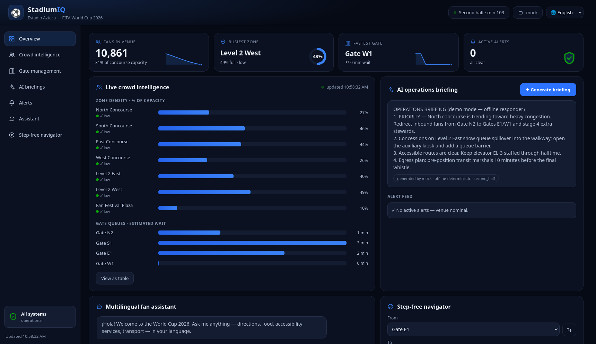

# ⚽ StadiumIQ — GenAI Operations Copilot for FIFA World Cup 2026

StadiumIQ is a real-time, GenAI-enabled operations platform for World Cup 2026 venues.
It gives **fans** a multilingual assistant and step-by-step accessible navigation, and gives
**organizers, volunteers, and venue staff** live crowd intelligence with AI-generated
operational briefings and decision support.

   



## What it does

| Capability | Who it serves | How GenAI is used |
|---|---|---|
| **Multilingual fan assistant** | Fans (any of 10+ languages) | LLM answers venue questions grounded in live stadium state |
| **Accessible navigation** | Fans, wheelchair users, families | Graph routing + LLM turns routes into friendly natural-language directions |
| **Crowd intelligence** | Organizers, security | Live zone density, gate throughput, congestion detection |
| **AI ops briefings** | Venue staff, volunteers | LLM converts raw telemetry into prioritized, actionable briefings |

## Quick start

### Docker (recommended)

```bash
docker compose up --build
# open http://localhost:8000
```

### Local

```bash
python -m venv .venv && source .venv/bin/activate
pip install -r requirements-dev.txt
uvicorn app.main:app --reload
# open http://localhost:8000
```

**No API keys required** — StadiumIQ degrades gracefully through a provider chain:

```
NVIDIA NIM  →  Google Gemini  →  Offline deterministic mock
(primary)      (backup)          (zero-config demo mode)
```

Add keys via `.env` (see `.env.example`) to enable live GenAI responses.

## Run the tests

```bash
pytest
```

## Architecture

```
static/          Zero-build dashboard UI (semantic HTML, WCAG-conscious)
app/
  main.py        App factory, middleware, static hosting
  config.py      Typed settings (pydantic-settings, env-driven)
  providers/     LLM provider chain: nvidia → gemini → mock
  services/      Domain logic: navigation graph, crowd simulator, briefings
  routes/        Thin REST layer (validation via pydantic schemas)
  data/          Stadium map dataset (zones, gates, POIs, walkway graph)
tests/           Offline pytest suite (no network, no keys needed)
docs/            Per-criterion engineering docs (see CLAUDE.md)
```

Full HLD & LLD — system context, component/class/sequence diagrams, data
model, and error taxonomy: [docs/DESIGN.md](docs/DESIGN.md).

## For reviewers — documentation map

Each judging dimension has a dedicated engineering doc explaining what we claim
and where the code backs it (index: [CLAUDE.md](CLAUDE.md)):

| Dimension | Doc | Highlights |
|---|---|---|
| Problem statement fit | [docs/PROBLEM_STATEMENT.md](docs/PROBLEM_STATEMENT.md) | Root challenge → feature → code mapping for all target users |
| Code quality | [docs/CODE_QUALITY.md](docs/CODE_QUALITY.md) | One-way layering, typed domain, DI, data-driven venue map |
| Security | [docs/SECURITY.md](docs/SECURITY.md) | Prompt-injection fencing, no-`innerHTML` rule, CSP, SecretStr keys, hardened container |
| Efficiency | [docs/EFFICIENCY.md](docs/EFFICIENCY.md) | Async I/O, LLM caching + rate limits, O(E log V) routing, slim image |
| Testing | [docs/TESTING.md](docs/TESTING.md) | 54 offline tests in 0.4s, 98% coverage; accessibility guarantee enforced as a test |
| Accessibility | [docs/ACCESSIBILITY.md](docs/ACCESSIBILITY.md) | Verified step-free routing, 10 languages, WCAG-conscious UI |

## CI/CD

Every push runs the full pipeline (`.github/workflows/ci.yml`):
**ruff** lint + format check → **mypy** type check → **pytest** matrix
(Python 3.12 & 3.14) → **pip-audit** dependency audit → **Docker** build +
container health smoke test. On `main`, deployment ships via Vercel's Git
integration and the pipeline finishes by probing the live `/api/health`
endpoint. Dependabot keeps pip, Actions, and the base image current.

## License

[MIT](LICENSE)
