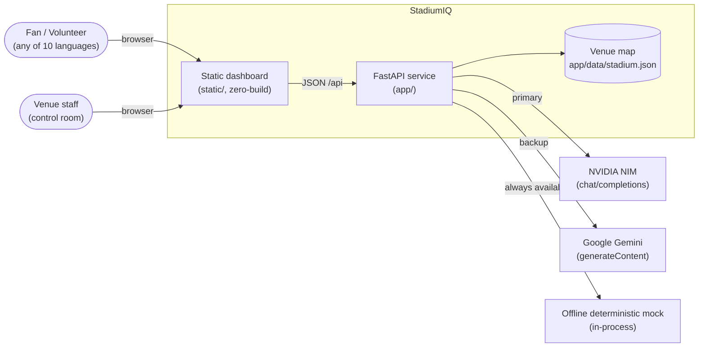
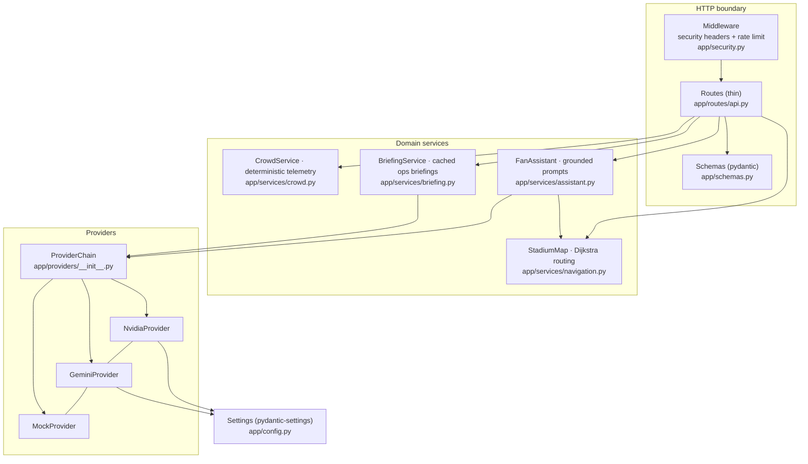
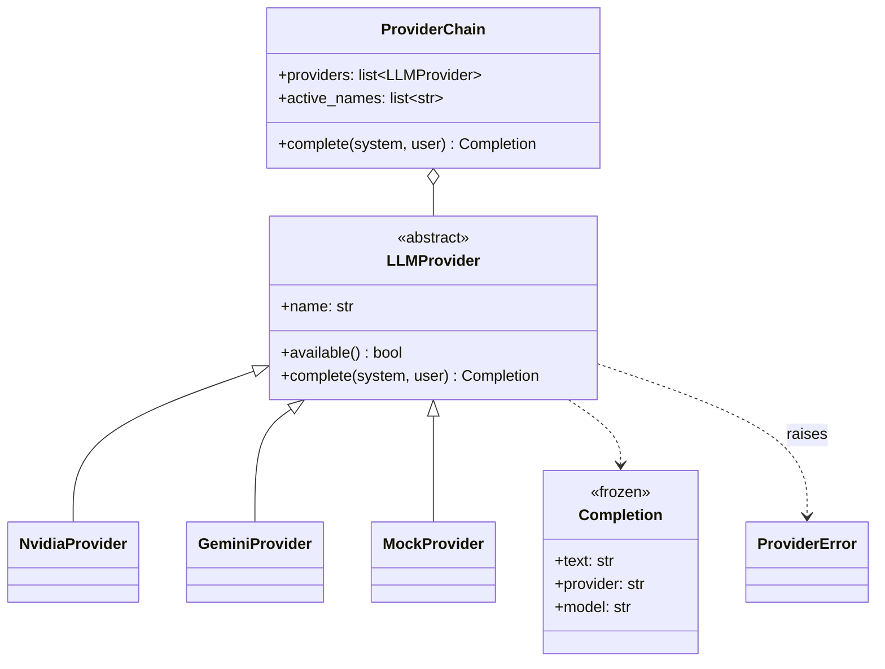
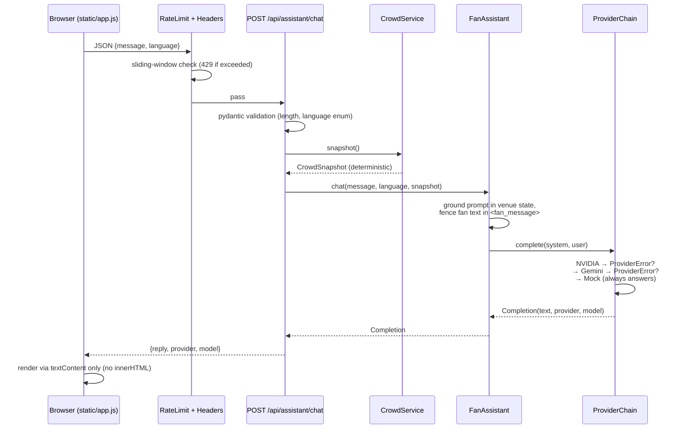
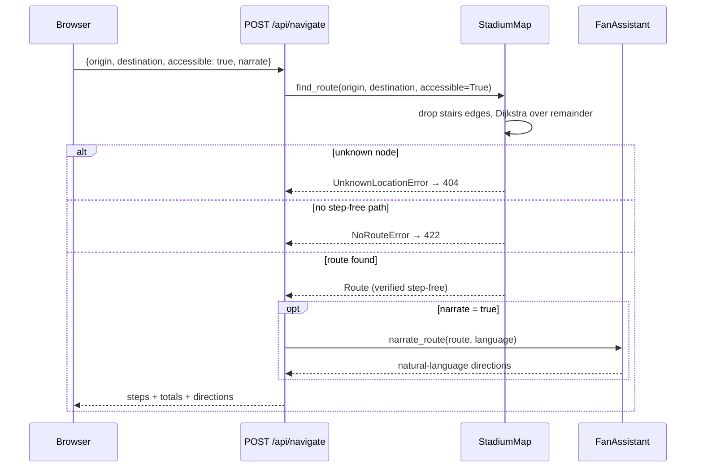

# Design — HLD & LLD

This document is the formal design record for StadiumIQ: the high-level
architecture (system context, components, deployment) and the low-level design
(module contracts, key sequences, data model, error taxonomy). Every element
here maps to code — file references are given throughout.

---

## High-Level Design

### System context

The system is a single service with no external state: the venue map is data,
crowd telemetry is simulated deterministically in-process (the contract a real
turnstile/CV feed would fill), and LLM access degrades through a provider
chain that terminates in an offline mock — so the platform runs with **zero
keys and zero network**.

### Component view (layers, one-way dependencies)

Rules the diagram encodes (enforced by review + tests):

- Dependencies point one way: `routes → services → providers`. No service
  imports HTTP types; no provider knows about services.
- All wiring happens once, in the app-factory lifespan (`app/main.py`) —
  dependency injection over globals, which is what makes the suite testable.
- Configuration is typed and centralized (`app/config.py`); secrets are
  `SecretStr` and optional by design.

### Deployment view

| Target | Mechanism | Notes |
|---|---|---|
| Local dev | `uvicorn app.main:app --reload` | zero keys → mock provider |
| Container | multi-stage `Dockerfile`, non-root, read-only fs | health-checked; compose file hardens further |
| Production | Vercel Git integration (`vercel.json`) | CI/CD gates + post-deploy health probe (`.github/workflows/ci.yml`) |

---

## Low-Level Design

### Module contracts

| Module | Public contract | Key invariants |
|---|---|---|
| `providers/base.py` | `LLMProvider.available() -> bool`, `complete(system, user) -> Completion`; frozen `Completion(text, provider, model)` | all failures normalize to `ProviderError` |
| `providers/__init__.py` | `ProviderChain.complete()`, `active_names`; `build_chain(settings, client)` | skips unavailable providers; falls through on `ProviderError`; mock terminates the chain |
| `services/navigation.py` | `StadiumMap.find_route(origin, destination, accessible) -> Route` | `accessible=True` removes every non-step-free edge **before** search — returned routes are verified step-free, not best-effort |
| `services/crowd.py` | `CrowdService.snapshot(match_minute) -> CrowdSnapshot` | pure function of the match clock: same minute ⇒ same telemetry (reproducible fixtures) |
| `services/assistant.py` | `chat(message, language, snapshot)`, `narrate_route(route, language)` | fan text is fenced in `<fan_message>` tags; prompts are grounded in server-generated state only |
| `services/briefing.py` | `generate(snapshot, language)` | cache key `(minute // 5, language)`, 60s TTL — refresh storms cannot fan out into LLM spend |
| `security.py` | `SecurityHeadersMiddleware`, `RateLimitMiddleware` | sliding 60s window per client IP, LLM-backed prefixes only; amortized idle-client pruning |

### Class relationships (providers)

Adding a provider = one new file implementing two methods + one line in
`build_chain()`. Nothing else changes (open/closed).

### Sequence: fan chat with provider fallback

### Sequence: step-free navigation

### Data model

- **Venue map (`app/data/stadium.json`)** — zones, nodes (gates, seating,
  concessions, restrooms, first aid, elevators, stairs, sensory room, transit),
  and edges `{a, b, meters, step_free}`. The graph is data: a new venue is a
  new JSON file, zero code changes.
- **Domain values** — frozen, slotted dataclasses (`Route`, `RouteStep`,
  `CrowdSnapshot`, `Completion`): immutable, typo-proof, cheap.
- **API boundary** — pydantic models (`app/schemas.py`) bound every input:
  message ≤ 1000 chars, node ids `^[a-z0-9_]+$`, language a closed enum,
  minute range-checked.

### Error taxonomy

| Error | Raised by | Handled as |
|---|---|---|
| `ProviderError` | any provider | chain falls through to the next provider |
| `UnknownLocationError` | navigation | HTTP 404 |
| `NoRouteError` | navigation | HTTP 422 |
| pydantic `ValidationError` | schema boundary | HTTP 422 (FastAPI) |
| rate-limit exceeded | middleware | HTTP 429 + `Retry-After` |

Errors are types, not strings — the type itself carries the handling policy.

### Cross-cutting decisions

- **Async I/O throughout**; one shared `httpx.AsyncClient` (lifespan-managed)
  pools connections across all LLM calls.
- **Caching**: briefings keyed by 5-minute telemetry buckets + language;
  `lru_cache` for settings and the parsed venue map.
- **Observability without leakage**: provider failures are logged by exception
  class only — payloads (which echo user input) and keys never reach logs.
